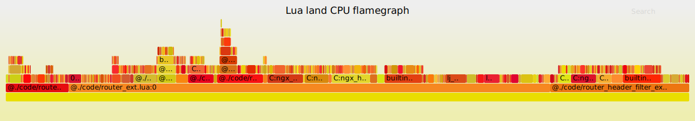

# app-router test report

## performance test compared with original nginx

* tools

    - [lua-land-cpu](https://github.com/openresty/stapxx#lj-lua-stacks)
    - [c-lan-cpu](https://github.com/openresty/nginx-systemtap-toolkit#sample-bt)
    - [wrk](https://github.com/wg/wrk)
    
* wrk result 

    - result of app-router 

	`# ./wrk -t12 -c100 -d30s http://9.91.39.77/scm/test`

	```
Running 30s test @ http://9.91.39.77/scm/test
  12 threads and 100 connections
  Thread Stats   Avg      Stdev     Max   +/- Stdev
    Latency    17.77ms    1.56ms  46.68ms   97.43%
    Req/Sec   451.98     34.42     0.97k    72.83%
  162113 requests in 30.04s, 80.57MB read
Requests/sec:   5396.25
Transfer/sec:      2.68MB
```

    - result of original nignx

	`# ./wrk -t12 -c100 -d30s http://9.91.39.77:9010/scm/test`
 
	```
 Running 30s test @ http://9.91.39.77:9010/scm/test
  12 threads and 100 connections
  Thread Stats   Avg      Stdev     Max   +/- Stdev
    Latency     4.88ms    1.13ms  22.50ms   76.44%
    Req/Sec     1.65k   208.15     2.39k    68.78%
  590453 requests in 30.02s, 257.60MB read
Requests/sec:  19670.87
Transfer/sec:      8.58MB
 ```

* cpu flame graph

    - **lua-land-cpu**
    
    
    
    - **c-land-cpu**
    
    


* Question

    - why does the RPS is much lower than original nginx forward?
    - how to investigate?


